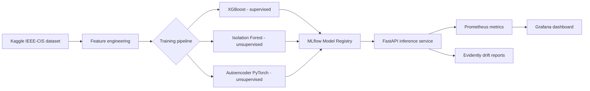

# fraud-detection-mlops

End-to-end MLOps pipeline for credit card fraud detection: from data ingestion to a containerized inference API with live monitoring and data drift detection.

[](https://github.com/oualidall/fraud-detection-mlops/actions/workflows/ci.yml)


## Why this project

Credit card fraud is a classic high-stakes ML problem:

- **Extreme class imbalance** (~0.1% positives) makes naive accuracy meaningless.
- **Both supervised and unsupervised signals** are useful.
- **Latency and explainability constraints** make pure offline metrics insufficient — the model has to run in production with monitoring.

This repository demonstrates a full MLOps lifecycle on the [IEEE-CIS Fraud Detection](https://www.kaggle.com/competitions/ieee-fraud-detection) dataset, applying the same engineering rigor expected in a production ML team.

## Architecture



## Tech stack

| Layer | Tools |
|---|---|
| Modeling | PyTorch, XGBoost, scikit-learn, imbalanced-learn |
| Experiment tracking | MLflow (tracking server + model registry) |
| API | FastAPI, Pydantic, Uvicorn |
| Monitoring | Prometheus, Grafana, Evidently AI |
| Containerization | Docker, docker-compose |
| CI / quality | GitHub Actions, pytest, ruff, black |

## Quick start

### 1. Clone and install

```bash
git clone https://github.com/oualidall/fraud-detection-mlops.git
cd fraud-detection-mlops
python -m venv .venv
source .venv/bin/activate    # Windows: .venv\Scripts\activate
pip install -r requirements.txt
```

### 2. Get the dataset

You need a [Kaggle account](https://www.kaggle.com/) and to accept the competition rules at https://www.kaggle.com/competitions/ieee-fraud-detection/rules.

```bash
cp .env.example .env
# Edit .env with your KAGGLE_USERNAME and KAGGLE_KEY
python -m src.data.download
```

### 3. Train and track

```bash
# Start MLflow tracking server (local)
mlflow server --host 0.0.0.0 --port 5000 &

# Train
python -m src.training.train --model xgboost
```

### 4. Serve

```bash
docker-compose up --build
```

Then:

- API docs: http://localhost:8000/docs
- MLflow UI: http://localhost:5000
- Grafana dashboard: http://localhost:3000

## Results

Validation set: most recent 118 108 transactions (temporal split), fraud rate 3.44 %.

| Model | ROC-AUC | AUC-PR | best F1 | Recall @ P=90% |
|---|---|---|---|---|
| Logistic Regression (baseline) | 0.830 | 0.189 | 0.318 | 0.0 % |
| **XGBoost** | **0.898** | **0.506** | **0.503** | **16.8 %** |

XGBoost achieves **2.7× higher AUC-PR** than the linear baseline and is the only model able to reach 90 % precision (the logistic regression never gets there). All runs are tracked with MLflow.

## Project status

- [x] **Phase 1** — Memory-safe Parquet pipeline, EDA notebook (182 days, 590k transactions)
- [x] **Phase 2** — Feature engineering, XGBoost + baseline with MLflow experiment tracking
- [x] **Phase 3** — FastAPI `/predict` service, Prometheus `/metrics`, Dockerfile, docker-compose
- [x] **Phase 4** — GitHub Actions CI (lint + test), Evidently data drift report

## Repository layout

```
fraud-detection-mlops/
|-- .github/workflows/    # CI pipelines (lint, tests, image build)
|-- data/                 # raw / processed datasets (gitignored)
|-- docker/               # Dockerfiles (API + training)
|-- docs/                 # diagrams, screenshots
|-- grafana/              # provisioned dashboards & datasources
|-- notebooks/            # EDA and modeling experiments
|-- src/
|   |-- api/              # FastAPI service
|   |-- data/             # data download & preprocessing
|   |-- features/         # feature engineering
|   |-- models/           # model definitions
|   |-- monitoring/       # drift detection (Evidently)
|   `-- training/         # training & evaluation scripts
|-- tests/                # pytest unit tests
|-- docker-compose.yml
|-- pyproject.toml
|-- requirements.txt
`-- README.md
```

## Skills demonstrated

- **MLOps**: experiment tracking, model registry, containerized serving, live monitoring, data drift detection, CI/CD.
- **Modeling**: supervised vs unsupervised approaches for highly imbalanced tabular data, hyperparameter tuning, calibrated probabilities.
- **Software engineering**: typed Python, packaging, modular layout, automated tests, linting.
- **DevOps**: multi-service docker-compose stack, Prometheus exporters, provisioned Grafana dashboards.

## License

[MIT](LICENSE)

## Author

**Oualid Allouch** — ML Engineer & MLOps practitioner
[LinkedIn](https://www.linkedin.com/in/oualid-allouch) · [GitHub](https://github.com/oualidall)
